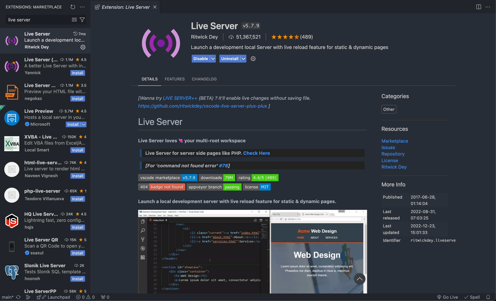
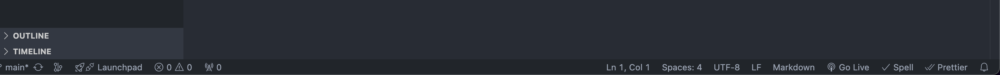

# TBC Concept

Install the vs code extension "live server" to run the project

After installation, you will see a "GO live" button to launch the extension in the lower right corner

If you don't see it, just reload vs code

You don't need to do anything else, no libraries or frameworks are used.
